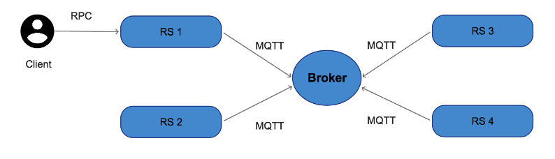

# Tugas RPC dan Message Oriented Middleware

## Kelompok
1. NIM Nama
2. NIM Nama

Pada soal ini, anda diminta untuk membuat mekanisme sinkronisasi data pasien antar rumah sakit dengan menggunakan metode komunikasi antar entitas : RPC dan Message Oriented Middleware berjenis Publish-Subscribe.

### Rancangan Sistem

Rancangan sistem yang anda tawarkan dapat dilihat pada gambar di atas. Pada rancangan tersebut, terdapat beberapa entitas antara lain :

#### A. Sensor Node
Terdapat satu atau beberapa sensor node yang terhubung ke sebuah server dengan ketentuan :
1.	Sensor Node mampu mengirimkan data hasil pembacaan sensor meliputi suhu (float), kelembaban (float) dan kadar CO2 (float)
2.	Sensor Node mengirimkan data tersebut ke server lewat mekanisme RPC.

#### B. Server (RS 1, RS 2, dll.)
Terdapat beberapa server penyimpanan data dengan kebutuhan fungsional sebagai berikut :
1.	Menerima data dari sensor node sakit menggunakan RPC.
2.	Menyimpan data sensor ke sebuah struktur data map di Golang. (https://tour.golang.org/moretypes/19)
3.	Melakukan publish data sensor ke server lain lain dengan protokol MQTT. Dalam posisi ini, server lain berperan sebagai subscriber.
4.	Selain berperan sebagai server RPC dan juga publisher, server (RS 1, RS 2, dll.) juga berperan sebagai subscriber yang menerima data sensor dari server lain untuk kemudian di simpan pada struktur data map miliknya.
5.	Mengirimkan daftar pasien ke client untuk ditampilkan.

#### C. Client
1. Client berperan untuk mendapatkan data dari server (RS 1, RS 2, dll.) dengan menggunakan RPC.

Untuk memenuhi kebutuhan tersebut, pada server terdapat beberapa remote procedure yang harus diimplementasikan :
- add_data(struct_data_sensor) untuk memasukkan data sensor baru
- get_data() untuk melihat data sensor

